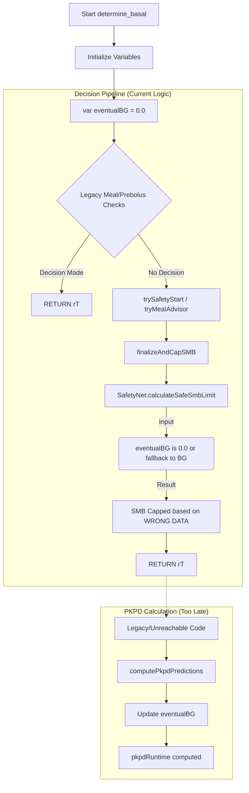

# AIMI Safety + PKPD Risk Analysis (MTR)

**Date:** 2026-01-13
**Author:** MTR (Analysis by Lyra AI)
**Scope:** `app.aaps.plugins.aps.openAPSAIMI.safety` & `app.aaps.plugins.aps.openAPSAIMI.pkpd`
**Target:** Identify causes of hypoglycemia and disconnected safety logic.

---

## 1. Executive Summary

🚨 **CRITICAL FINDING: CHRONOLOGICAL DISCONNECT**

The analysis has identified a **major structural flaw** in `DetermineBasalAIMI2.kt`. The PKPD prediction engine (`computePkpdPredictions`) is executed **AFTER** the main decision pipeline (`trySafetyStart`, `tryMealAdvisor`) has already run and potentially returned a decision.

**Risks Identified:**
1.  **Blind SafetyNet (High Risk):** The `SafetyNet.calculateSafeSmbLimit` function relies on `eventualBG` to detect future lows and cap SMBs. Currently, at the time of execution, `eventualBG` is effectively uninitialized (or falls back to current BG via `sanity`), rendering the safety checks useless against predicted drops.
2.  **Fail-Open Logic:** The system defaults to permissiveness when predictions are missing (using current BG instead of a conservative value), leading to over-correction during rapid rises which are destined to crash (e.g., UAM spikes).
3.  **Unused PKPD Runtime:** The `pkpdRuntime` object, intended to provide dynamic DIA and peak time adjustments for safety (`applySafetyPrecautions`), is explicitly passed as `null` in the decision pipeline because it hasn't been computed yet.

**Verdict:**
PKPD is **NOT degraded**, but it is **effectively disconnected** from the decision-making process due to execution order. The logical capability to prevent hypos exists but is not being used.

---

## 2. Decision Dataflow (Exact & Broken)

This diagram illustrates the current execution flow in `DetermineBasalAIMI2.determine_basal()`:



**Consequence:** The "Decision Pipeline" makes decisions *as if* the future trajectory is flat (fallback to BG), ignoring IOB/COB curves calculated by PKPD.

---

## 3. PKPD Deep Dive

### 3.1 Key Classes & Integrity
*   **Path:** `plugins/aps/src/main/kotlin/app/aaps/plugins/aps/openAPSAIMI/pkpd/`
*   **Engine:** `AdvancedPredictionEngine.predict()` (Line 3243 in DetermineBasal)
*   **State:** The code appears robust. It correctly uses modern IOB (`iobArray`), COB, and sensitivity models.
*   **Issue:** It is simply called too late.

### 3.2 Over-correction Mechanism
The `PkPdRuntime` calculates a `sigmoidDamping` factor to reduce SMBs when "tail saturation" (accumulation of insulin impact in 3-4h) is high.
*   **Current state:** Because `pkpdRuntime` is `null` during `applySafetyPrecautions`, this damping is **skipped**.
*   **Result:** SMBs are delivered at full strength even if the "tail" of insulin action is dangerously high, leading to stacking and delayed hypoglycemia.

---

## 4. Safety Deep Dive

### 4.1 Key Classes
*   **Path:** `plugins/aps/src/main/kotlin/app/aaps/plugins/aps/openAPSAIMI/safety/SafetyNet.kt`
*   **Method:** `calculateSafeSmbLimit`

### 4.2 The "Blind Spot"
In `SafetyNet.kt`:
```kotlin
// Predictive Check
if (eventualBg < 120.0) {
    return maxSmbLow // Restrict to conservative limit
}
```
*   **Scenario:** BG is 150 mg/dL, trending up (+5). PKPD predicts 90 mg/dL in 2 hours due to 5U IOB.
*   **Reality:** `eventualBg` passed to SafetyNet is not 90, but ~150 (fallback).
*   **Result:** `150 < 120` is FALSE. The check is bypassed. `SafetyNet` allows `maxSmbHigh` (Aggressive).
*   **Outcome:** System forces more SMBs on top of existing IOB -> Hypoglycemia.

### 4.3 Fail-Open Gaps
*   `sanitizePredictionValues` (Line 4549): If `eventualBG` is invalid, it defaults to `bg`. This is "Fail-Open" (assuming stability) rather than "Fail-Safe" (assuming risk).

---

## 5. Missing Connections

| Component | Status | Impact |
| :--- | :--- | :--- |
| **Prediction Link** | ❌ **BROKEN** | `eventualBG` is not updated before use. |
| **PkPd Runtime** | ❌ **MISSING** | `null` passed to `applySafetyPrecautions`. |
| **Safety Sanity** | ⚠️ **WEAK** | Defaults to current BG instead of erroring out or being conservative. |

---

## 6. Fix Proposals

### ✅ Fix 1: Chronological Reordering (URGENT)
Move the `computePkpdPredictions` call to the very top of `determine_basal`, right after `GlucoseStatus` initialization.

**Impact:** Ensures `eventualBG`, `predBGs`, and `pkpdRuntime` are available for ALL decision branches.

**Pseudo-code (DetermineBasalAIMI2.kt):**
```kotlin
// ... GlucoseStatus init ...

// 1. CALCULATE PKPD FIRST
val pkpdPredictions = computePkpdPredictions(...)
this.eventualBG = pkpdPredictions.eventual
rT.eventualBG = pkpdPredictions.eventual
rT.predBGs = ...

// 2. Initialize Logic
val pkpdRuntime = pkpdIntegration.computeRuntime(...)

// 3. THEN run Decision Pipeline
val safetyRes = trySafetyStart(..., sanity.eventualBg) // Now valid!
val advisorRes = tryMealAdvisor(...)
```

### ✅ Fix 2: Inject PKPD Runtime into Safety
Pass the computed `pkpdRuntime` to `finalizeAndCapSMB` and `applySafetyPrecautions`.

**Code Change:**
```kotlin
// In applySafetyPrecautions call:
pkpdRuntime = pkpdRuntime, // Pass the object, NOT null
```

### ✅ Fix 3: Stale Prediction Guard
In `SafetyNet`, trigger a fallback if prediction is suspiciously identical to current BG (loopback artifact).

---

## 7. Tests & Validation Plan

### Unit Tests (Scenarios)

1.  **The "UAM Crash"**:
    *   **Input:** BG 160, Delta +8, IOB 6U (massive).
    *   **Expected PKPD:** Eventual 70.
    *   **Current Behavior:** Eventual 160 -> SMB Aggressive.
    *   **Fixed Behavior:** Eventual 70 -> SafetyNet restricts to `maxSmbLow`.

2.  **The "Ghost Prediction"**:
    *   **Input:** BG 120, Delta 0, No Data.
    *   **Expected:** SafetyNet restricts due to missing data.
    *   **Test:** Ensure `auditorConfidence` or `predMissing` reduces unsafe outputs.

### Manual Simulation Checklist
Use the "Detailed Log" to verify:
- [ ] Search for `PRED_PIPE`.
- [ ] Check `eventualBg=...`. It MUST differ from `bg` if there is IOB.
- [ ] If `eventualBg == bg` while `IOB > 0`, the fix is NOT working.

### Logging Audit
Ensure these lines appear BEFORE any "APPLIED" log:
```
🏥 PHYSIO: ...
PKPD predictions → eventual=...
```

---
**End of Analysis**
