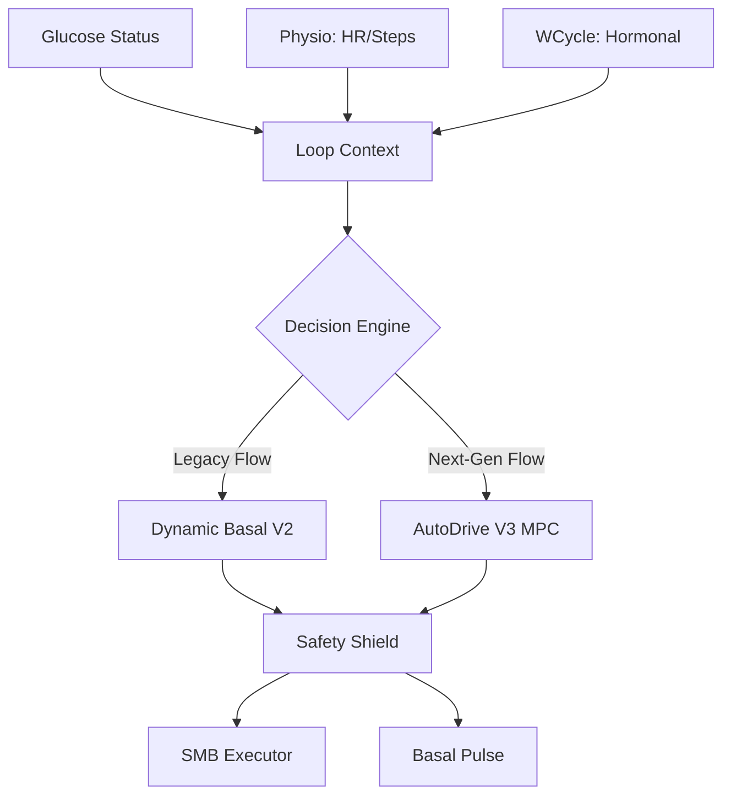

# OpenAPS AI MI: Architectural Overview

This document describes the high-level architecture of the OpenAPS AI MI module, focusing on the data flow and the division of responsibilities between the V2 (PI Control) and V3 (AutoDrive/MPC) engines.

## 🧱 Layered Architecture

The system is organized into three logical layers:

1.  **Context Layer**: Aggregates raw medical data (BG, IOB, COB) and physiological stressors (HR, Steps, Hormonal Cycle).
2.  **Decision Layer**: The core intelligence. It forecasts future glucose states and computes optimal insulin adjustments.
3.  **Execution Layer**: Enforces safety limits, damps aggressive decisions, and communicates with the hardware pump.

## 🔄 Data Flow Map

## 🧠 Decision Engines

### Dynamic Basal Controller (V2)
- **Algorithm**: Proportional-Integral (PI) Controller.
- **Goal**: Maintain long-term basal stability.
- **Strength**: Handles slow drifts and steady-state conditions with high fluidity.

### AutoDrive Engine (V3)
- **Algorithm**: Model Predictive Control (MPC).
- **Goal**: Aggressive correction and meal handling.
- **Strength**: Proactive handling of rapid rises and high-stress scenarios using physiological forecasting.

## 🛡️ Safety Guards

All decisions, regardless of the source engine, must pass through the **Safety Shield**:
- **Trajectory Guard**: Ensures glucose stays within a "Stable Orbit" in phase-space.
- **Absorption Guard**: Prevents over-bolusing when high insulin concentration is detected.
- **LGS Fallback**: Forced return to profile basal if low glucose levels are predicted.
